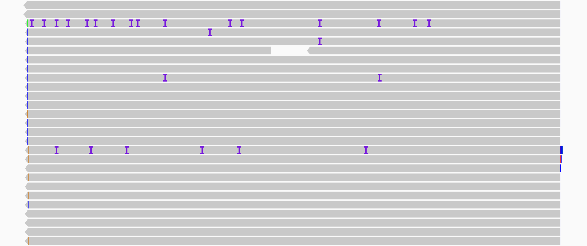
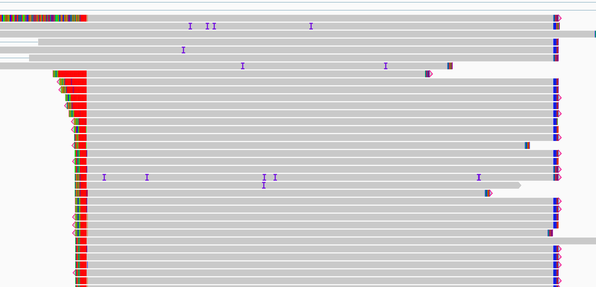

I am tasked with finding out if raw long reads can disambiguate the transcript structures of the SRA1 gene. To start with I'm looking at histone H2BC21 which is a histone variant in humans, which should have a *simple transcript structure*, since it only has 1 intron. However, when I look at the long reads obtained from PacBio sequencing, there are way more errors than you would expect from a super conserved gene like a histone (Tom noticed this). Each purple "I" shaped thing is an insertion, the colored regular lines are mutations (in IGV). It appears that some reads are exactly identical and some are riddled with errors. Also what is going on in the right picture, where theres a billion things after the poly-A tail that are soft-clipped? Maybe the poly-A tail (showing up as poly-T here) is soft-clipped and then everything else after that gets thrown out by the aligner too, even though its probably read-through of some downstream thing (the UTR?). That can't be the case because it is showing them as mutations, so they actually don't match the reference. Is RNA-Pol just adding random nucleotides? Is reverse transcriptase? Wot.

    
    

